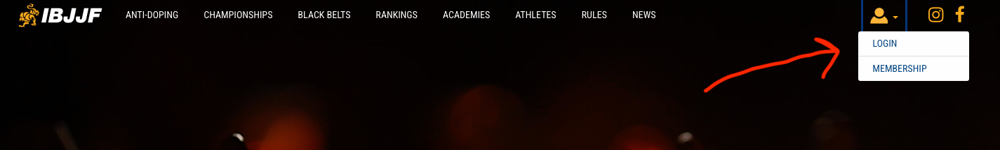
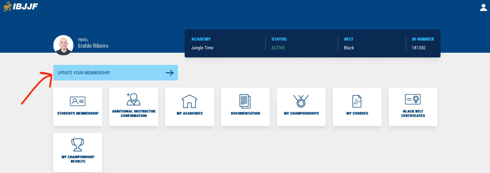
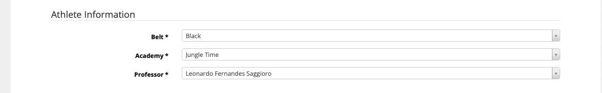
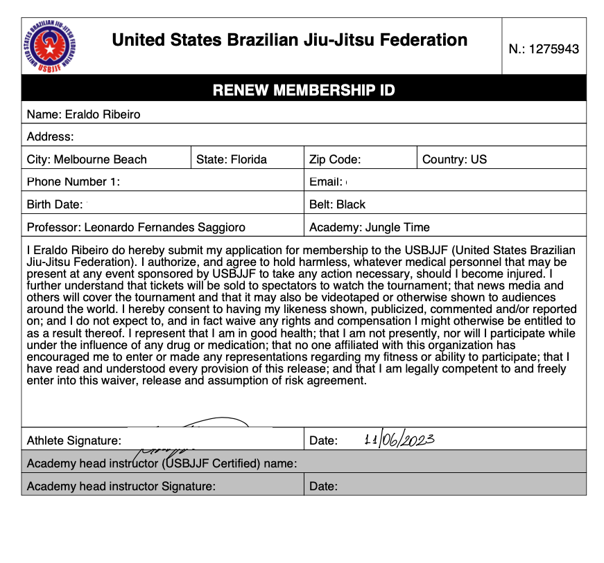

### How to apply for (or renew) your IBJJF Membership

1. Sign to your IBJJF account (or create one): https://ibjjf.com

2. Login to your account (or create one). 

   

3. On your account’s dashboard. Select the Membership (renew, new membership) option. For example, my dashboard has a blue rectangle labeled “Update Your Membership”: 

   

4. Complete the membership form and follow the steps. Enter your information. In the “Athlete Information” parts, enter your belt and academy information:

   

5. In the next step, you will need to download the membership-request form, sign it, and then upload the form to the IBJJF website. I think the system might even email this form to you once you complete the previous step. Once you upload the signed form, the system will show your application as “pending”. See example form below:

    

   6. Let professor Saggioro know that you applied for your membership (or renewal) so he can go online and approve your request. Once he approves the request, you can make the payment of the membership fee and the process will be completed. For new memberships, you might need to upload more documents or maybe you will need the actual professor’s signature on the form (I don’t remember this part anymore!). 